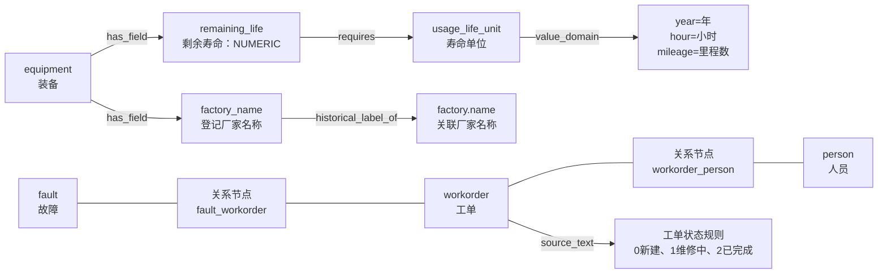

```mermaid
flowchart LR
    E["equipment<br/>装备"] -->|has_field| L["remaining_life<br/>剩余寿命：NUMERIC"]
    L -->|requires| U["usage_life_unit<br/>寿命单位"]
    U -->|value_domain| V["year=年<br/>hour=小时<br/>mileage=里程数"]

    E -->|has_field| M["factory_name<br/>登记厂家名称"]
    M -->|historical_label_of| N["factory.name<br/>关联厂家名称"]

    F["fault<br/>故障"] --- FW["关系节点<br/>fault_workorder"]
    FW --- W["workorder<br/>工单"]
    W --- WP["关系节点<br/>workorder_person"]
    WP --- P["person<br/>人员"]

    W -->|source_text| S["工单状态规则<br/>0新建、1维修中、2已完成"]
```
